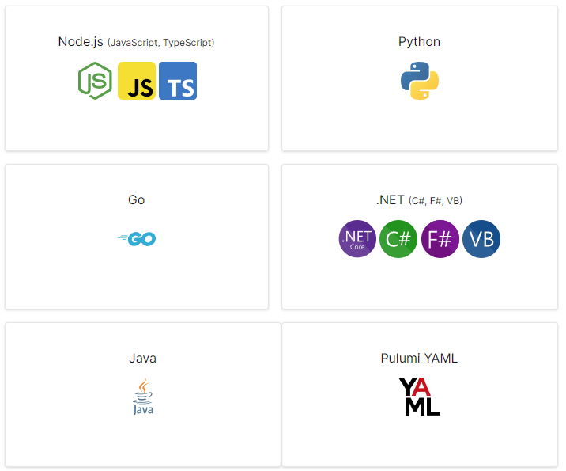

# Deploying to 1 or More Clouds with Pulumi

with Al Rodriguez

---

# Online Info

- Al Rodriguez
  - @ProgrammerAL
  - https://programmeral.com/about

- Session Materials
  - https://github.com/ProgrammerAl/Presentations-2023
  - TODO: Replace with link to personal site
  - TODO: Include QR Code to personal site

---

# What this session is

- Introduction to Pulumi
- Assumes you know nothing about it
  - Or you've heard about it but never looked into it
- Uses C#, Azure, and DigitalOcean
  - But the concepts apply to other languages and clouds supported by Pulumi

---

# Quick Example Code

```csharp
using System.Collections.Generic;
using Pulumi;
using Pulumi.Eks;

await Deployment.RunAsync(() =>
{
  // Create an EKS cluster with default settings.
  var cluster = new Cluster("eks-cluster");

  // Export the cluster's kubeconfig.
  return new Dictionary<string, object?>
  {
    ["kubeconfig"] = cluster.Kubeconfig
  };
});
```

---
# What is Pulumi?

- Tooling for managing cloud infrastructure
  - Create/Read/Update/Delete services
  - IaC - Infrastructure as Code
  - DSC - Desired State Configuration
- Open Sourced
  - _Can_ be free if you self host
- Procedural and Imperative


---

# What Pulumi isn't

- It's not a Cross-Platform abstraction
  - Clouds are target specifically
  - Ex: Cloud storage different between AWS S3 and Azure Blob Storage

---


# Programming Languages Supported

- Many programming languages supported and being added


--- 

# Cloud Providers Supported

- All the big ones
    - AWS, Azure, GCP, etc
- Other big but lesser known ones
    - DigitalOcean, Fastly, Scaleway, etc
- Utility SaaS Providers
    - Auth0, RedisCloud, DNSimple, GitHub, etc
- View all at: [pulumi.com/registry](https://www.pulumi.com/registry)
    - 1st party and 3rd party

--- 

# Demo 1 Time!

- Pulumi CLI
- Code
- Web Portal

---

#


---

# Input and Output Objects

- Object for a resource to be created
- Inputs
  - Become Outputs
- Outputs
  - Will have a value eventually...in the future
    - Ex: GUID id of a storage account
  - Used to modify a dependency in code

---


