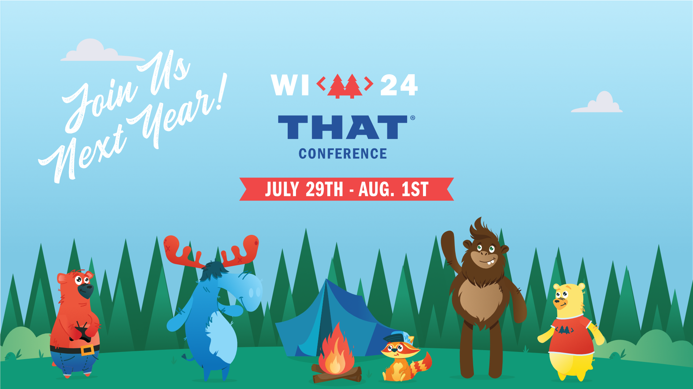
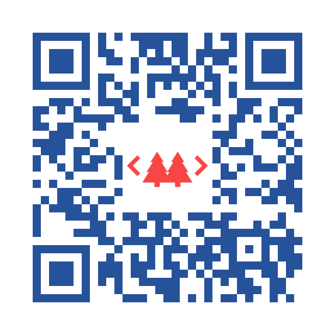

# Deploying Infrastructure to 1 or More Clouds with Pulumi

with AL Rodriguez

---

#

---

#

<!-- 
footer: ""
 -->
<!-- 
backgroundImage: ""
 -->

---
#

<!-- 
class: "lead"
 -->

---

# Online Info

- @ProgrammerAL
- https://programmerAL.com

<!-- 
footer: "@ProgrammerAL"
 -->
<!-- 
backgroundImage: "url('presentation-images/Simple_Footer.png') "
 -->
<!-- 
class: ""
 -->

---

# What this session is

- Introduction to Pulumi
- Assumes you know nothing about it
  - Or you've heard about it but never looked into it
- Uses C#, Azure, and DigitalOcean
  - But the concepts apply to other languages and clouds supported by Pulumi

---

# What is Pulumi?

- Tooling for managing cloud infrastructure
  - Create/Read/Update/Delete services
  - IaC - Infrastructure as Code
  - DSC - Desired State Configuration
- Procedural and Imperative
- Open Sourced
  - _Can_ be free if you self host

---

# What Pulumi isn't

- It's not a Cross-Platform abstraction
  - Clouds are target specifically
  - Ex: Cloud storage different between AWS S3 and Azure Blob Storage

---

# Programming Languages Supported

- Many programming languages supported and being added

--- 

# Cloud Providers Supported

- All the big and less known ones
    - AWS, Azure, GCP, etc
    - DigitalOcean, Fastly, Scaleway, etc
- Utility SaaS Providers
    - Auth0, RedisCloud, DNSimple, GitHub, etc
- View all at: [pulumi.com/registry](https://www.pulumi.com/registry)
    - 1st party and 3rd party

--- 

# Demo 1 Time!

- Code
- Pulumi CLI
- Web Portal

---

# Pulumi Features Overview

- Application Flow
- Input/Outputs
- Config
- Stacks

---

#

<!-- 
footer: ""
 -->
<!-- 
backgroundImage: ""
 -->
---

# Simple Pulumi Flow

1. Run Your Code
2. Determine Desired State
3. Use Providers to CRUD Services to Match Desired State

<!-- 
footer: "@ProgrammerAL"
 -->
<!-- 
backgroundImage: "url('presentation-images/Simple_Footer.png') "
 -->
---

# Input and Output Objects

- Object for a resource to be created
- Outputs
  - Mark a Dependency
  - Will have a value eventually...in the future
    - Ex: GUID id of a storage account
  - Used to modify a dependency in code

---

# Example: Demo Application

- Azure Function given reference to DigitalOcean Spaces resource endpoint
  - It needs to know where to send data
- Pulumi creates full DSC, THEN modifies infrastructure
  - So it knows to create DigitalOcean Spaces resource, THEN Azure Functions resource
  - But our code doesn't have to (directly) know about that dependency

---

#

<!-- 
footer: ""
 -->
<!-- 
backgroundImage: ""
 -->
---

# Output Apply()

- Raw Method
  - `var url = vm.DnsName.Apply(dnsName => "https://" + dnsName);`
- String Interpolation
  - `var url = Output.Format($"http://{hostname}:{port}/");`

<!-- 
footer: "@ProgrammerAL"
 -->
<!-- 
backgroundImage: "url('presentation-images/Simple_Footer.png') "
 -->

---

# Config

- YAML Files
- Per Stack
- Individual Key-Value pairs
  - Or objects

---

# Config Secrets

- Encrypted in config
- Per Stack
- Loaded as an Output value
- Plan-Text viewable via Pulumi CLI when signed in

---

# Stack Outputs

- Set by You, your code
- Usable in:
  - Stack References
  - `Pulumi.README.md` files

---

# Stack References

- Access Stack Outputs from other stacks
  - Same app or others

---

# Demo 2 Time!

- Pulumi Code
- Demo App
  - Azure Function receives REST request, puts body into file stored in DigitalOcean Spaces

---

