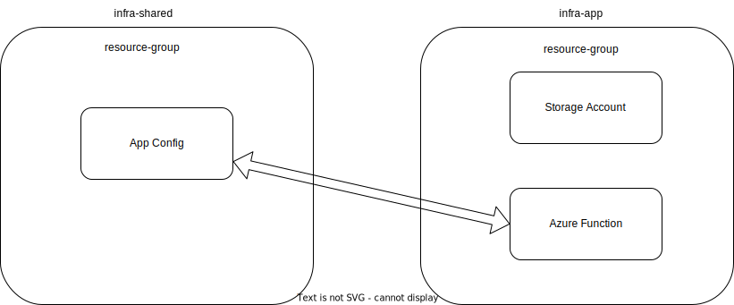

# Pracical Pulumi

with AL Rodriguez

---

# Me (AL)

- @ProgrammerAL
- programmerAL.com
- NOT affiliated with Pulumi

---

# What this session is

- Intermediate session to Pulumi
- Assumes you know the basics
  - Maybe you've used it already
- Uses C# and Azure
  - But the concepts apply to other languages and clouds supported by Pulumi

---

# Demo Diagram

---

#

---

# Dependencies

---

# Inputs/Outputs

- Dependencies
- Usually values don't exist yet
  - Ex: Azure Function Endpoint
- `Output<string> url = func.Endpoint.Apply(x => $"https://{x}")`
  - Doesn't run the lambda until `.Endpoint` has a value

---

# Config

---

# Config Suggestions

- Load Objects when possible
- Avoid Exceptions mid-run
  - Load everything at the start
  - Load values as `required`

---

# Config Inputs?

- Spoiler: Doesn't exist!
- Edit YAML before running
  - As part of CI/CD pipeline
- Load from external source with custom code
  - The config values are not tracked

---

# Secrets

- `pulumi config set mysecret myvalue --secret`
  - Encrypted into YAML
  - Accessible to anyone signed in with permissions
- Load using provider
  - 1Password, etc
- Load from external source with custom code
  - The config values are not tracked

---

# Pulumi ESC

- ESC = Environments, Secrets, and Configuration
- Separate tool, bundled with the Pulumi CLI
- Consume config from anywhere

---

# Other Stuff

---

# Stack References

- Load Outputs from other Stacks
- Order Matters

---

# Get Functions

- Load cloud resources that already exist
- Read-Only
- Not necessarily managed by Pulumi

---

# Automation API

- API to run Pulumi outside of console
  - Don't have to use `pulumi up`
- Common Use Cases: CI/CD or internal portal

---

# Concept: Deploy App with Pulumi

- Can also deploy app when deploying cloud infra with Pulumi
  - Totally your choice
- Same amount of dependencies
- If together
  - Can set app config values with Pulumi
- If separate
  - Can use Automation API to set app config values

---

# Automated Testing

- Unit Tests
  - API can be mocked in code to let unit tests run
  - Useful if your Pulumi code has custom logic
- Automation Tests
  - Probably more useful overall

---

# Custom Resources

- Wrapper around existing resources
- Can create in 1 language, export to others

---

# Pulumi AI

- Generate Pulumi Code using that thing everyone's talking about
- pulumi.com/ai

---

# Online Info

- @ProgrammerAL
- programmerAL.com

